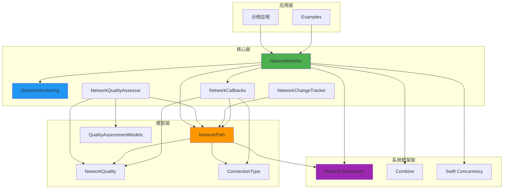
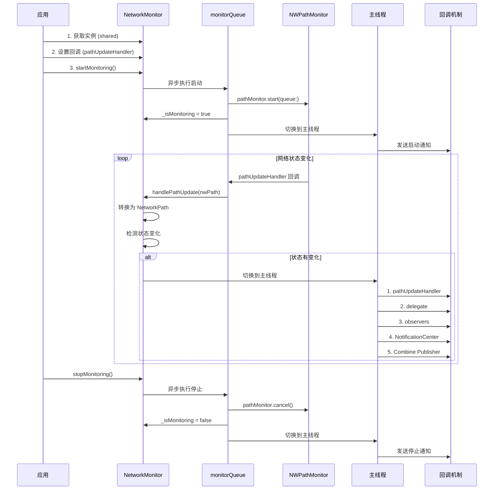
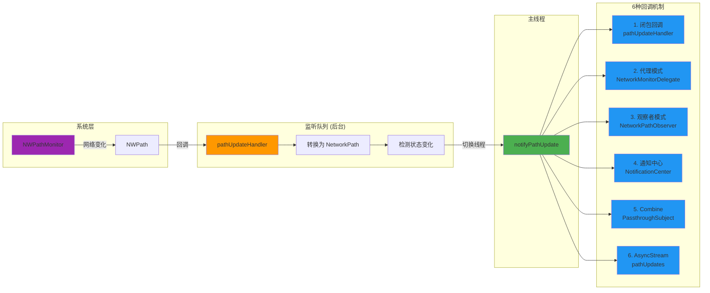
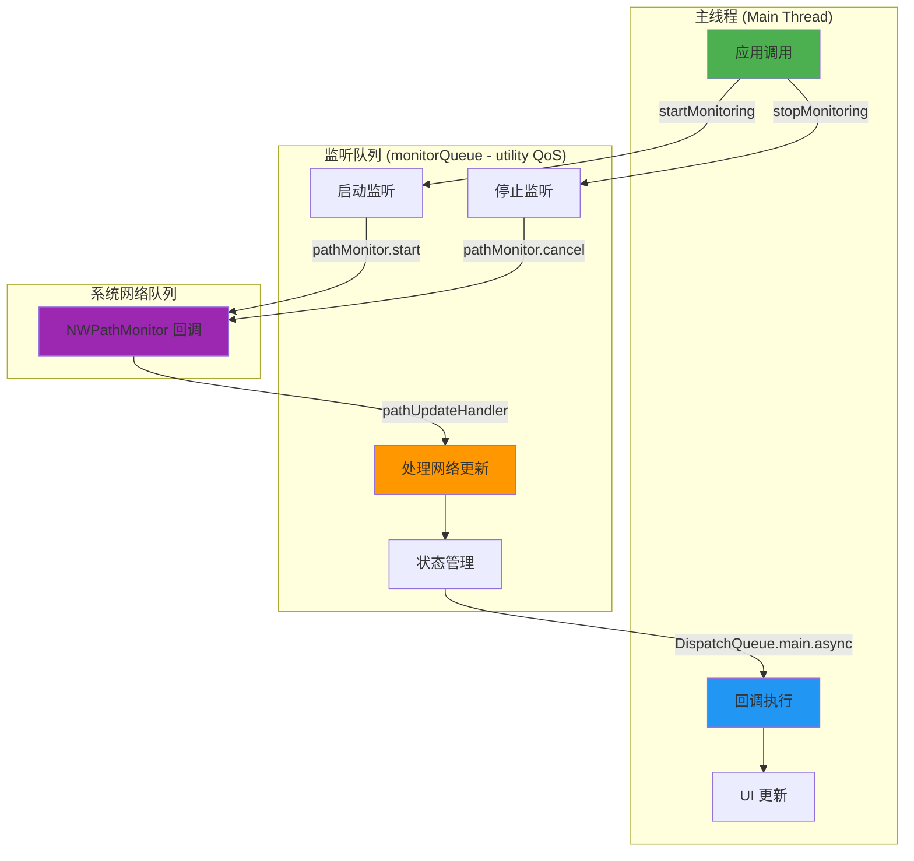
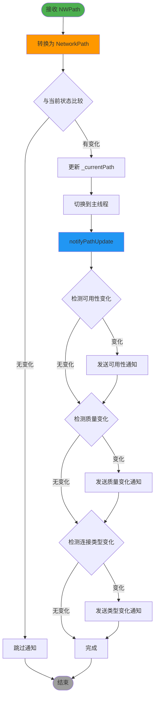
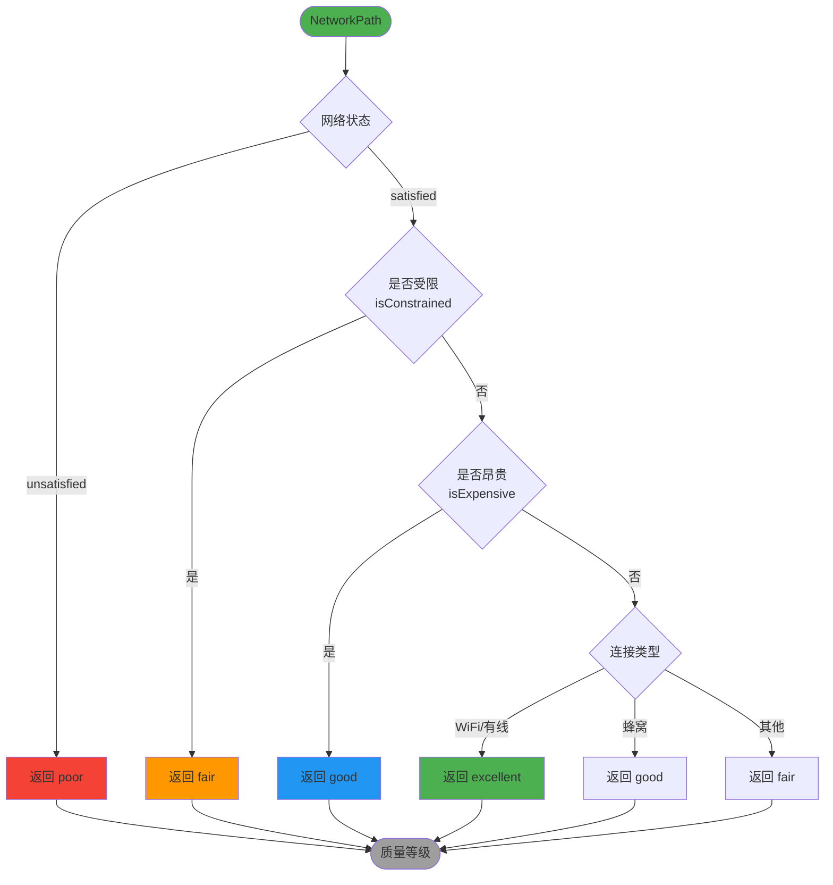

# XFENetworkMonitor 架构分析文档

> 系统性深入分析 XFENetworkMonitor 项目的架构设计、数据流、线程模型和实现细节

**文档版本**: 1.0  
**创建日期**: 2025-11-27  
**项目版本**: XFENetworkMonitor 1.0+

---

## 📚 目录

1. [整体架构分析](#1-整体架构分析)
2. [流程图梳理](#2-流程图梳理)
3. [功能模块分析](#3-功能模块分析)
4. [代码实现细节](#4-代码实现细节)
5. [底层依赖框架](#5-底层依赖框架)
6. [设计模式总结](#6-设计模式总结)
7. [性能与优化](#7-性能与优化)

---

## 1. 整体架构分析

### 1.1 项目结构概览

```
XFENetworkMonitor/
├── Sources/
│   ├── NetworkMonitor/          # 核心库代码
│   │   ├── Core/                # 核心功能模块
│   │   │   ├── NetworkMonitor.swift           # 主监听器类
│   │   │   ├── NetworkMonitoring.swift        # 核心协议定义
│   │   │   ├── NetworkCallbacks.swift         # 回调机制定义
│   │   │   ├── NetworkQualityAssessor.swift   # 质量评估器
│   │   │   ├── NetworkChangeTracker.swift     # 变化追踪器
│   │   │   └── NetworkMonitorError.swift      # 错误定义
│   │   └── Models/              # 数据模型
│   │       ├── NetworkPath.swift              # 网络路径模型
│   │       ├── NetworkQuality.swift           # 质量等级枚举
│   │       ├── ConnectionType.swift           # 连接类型枚举
│   │       └── QualityAssessmentModels.swift  # 质量评估模型
│   ├── Examples/                # 示例代码
│   │   ├── SwiftUI/             # SwiftUI 示例
│   │   ├── UIKit/               # UIKit 示例
│   │   └── Advanced/            # 高级用例
│   └── docs/                    # 文档
│       ├── USER_GUIDE.md        # 用户指南
│       └── API_REFERENCE.md     # API 参考
├── XFENetworkMonitor/           # 示例应用
├── XFENetworkMonitorTests/      # 单元测试
└── XFENetworkMonitorUITests/    # UI 测试
```

### 1.2 核心模块职责划分

| 模块 | 职责 | 关键类/协议 |
|------|------|------------|
| **Core** | 核心网络监听功能 | `NetworkMonitor`, `NetworkMonitoring` |
| **Models** | 数据模型和枚举 | `NetworkPath`, `NetworkQuality`, `ConnectionType` |
| **Callbacks** | 回调机制定义 | `NetworkMonitorDelegate`, `NetworkPathObserver` |
| **Quality** | 网络质量评估 | `NetworkQualityAssessor` |
| **Tracking** | 变化追踪统计 | `NetworkChangeTracker` |
| **Examples** | 使用示例 | SwiftUI/UIKit 示例 |
| **Docs** | 文档资料 | 用户指南、API 参考 |

### 1.3 模块依赖关系图



### 1.4 设计模式应用

| 设计模式 | 应用位置 | 设计理由 |
|---------|---------|---------|
| **单例模式** | `NetworkMonitor.shared` | 全局唯一网络监听实例，避免资源浪费 |
| **观察者模式** | `NetworkPathObserver` | 一对多通知，松耦合设计 |
| **代理模式** | `NetworkMonitorDelegate` | 面向对象回调，类型安全 |
| **协议导向** | `NetworkMonitoring` | 依赖抽象，提高可测试性 |
| **工厂模式** | `monitor(for:)` | 创建特定类型监听器 |
| **策略模式** | `NetworkQualityAssessor` | 多维度质量评估策略 |
| **发布-订阅** | Combine Publisher | 响应式编程支持 |

---

## 2. 流程图梳理

### 2.1 网络监控完整生命周期



### 2.2 数据流转流程



### 2.3 线程调度模型



### 2.4 状态变化检测流程



### 2.5 网络质量评估流程



---

## 3. 功能模块分析

### 3.1 核心功能模块

#### 3.1.1 NetworkMonitor - 核心监听器

**职责**：
- 封装 `NWPathMonitor`，提供统一的网络监听接口
- 管理监听生命周期（启动、停止）
- 线程安全的状态管理
- 多种回调机制的分发

**关键属性**：
```swift
// 系统监听器
private let pathMonitor: NWPathMonitor

// 专用队列 (utility QoS)
private let monitorQueue: DispatchQueue

// 当前网络路径（线程安全）
private var _currentPath: NetworkPath?

// 监听状态
private var _isMonitoring: Bool = false
```

**设计亮点**：
- ✅ 单例模式确保全局唯一实例
- ✅ 使用专用队列避免阻塞主线程
- ✅ 队列同步访问确保线程安全
- ✅ weak 引用避免循环引用

#### 3.1.2 NetworkPath - 网络路径模型

**职责**：
- 封装网络连接的完整状态信息
- 提供便捷的计算属性
- 支持序列化和存储

**关键属性**：
```swift
public let status: NWPath.Status           // 网络状态
public let connectionType: ConnectionType  // 连接类型
public let isExpensive: Bool               // 是否昂贵
public let isConstrained: Bool             // 是否受限
public let supportsIPv4: Bool              // IPv4 支持
public let supportsIPv6: Bool              // IPv6 支持
public let supportsDNS: Bool               // DNS 支持
public let timestamp: Date                 // 时间戳
```

**设计亮点**：
- ✅ 值类型（struct）确保线程安全
- ✅ 不可变属性避免意外修改
- ✅ 支持 Codable 便于序列化
- ✅ 提供丰富的计算属性

#### 3.1.3 NetworkQualityAssessor - 质量评估器

**职责**：
- 多维度评估网络质量
- 提供详细的质量分析
- 生成优化建议

**评估维度**：
1. **网络状态** (statusScore): 0.0-1.0
2. **用户约束** (constraintScore): 0.0-1.0
3. **网络成本** (costScore): 0.0-1.0
4. **连接类型** (typeScore): 0.0-1.0
5. **协议支持** (protocolScore): 0.0-1.0

**评估优先级**：
```
1. 网络状态 (最高优先级)
   ↓
2. 用户约束 (尊重用户意图)
   ↓
3. 网络成本 (避免额外费用)
   ↓
4. 连接类型 (速度和稳定性)
```

**设计亮点**：
- ✅ 多维度综合评估
- ✅ 优先级清晰合理
- ✅ 提供详细分析和建议
- ✅ 支持趋势分析

#### 3.1.4 NetworkChangeTracker - 变化追踪器

**职责**：
- 追踪和记录网络状态变化历史
- 提供变化分析和统计功能
- 检测频繁断连模式

**核心功能**：
```swift
// 记录网络变化
func recordPathChange(_ newPath: NetworkPath, previousPath: NetworkPath?)

// 获取统计信息
func getStatistics() -> ChangeStatistics

// 获取变化历史
func getChangeHistory(limit: Int) -> [NetworkChangeRecord]
```

**设计特性**：
- ✅ 环形缓冲区避免内存无限增长
- ✅ 智能过滤避免噪音数据
- ✅ 多维度分析（时间、质量、类型）
- ✅ 线程安全的队列保护

### 3.2 六种回调机制详解

#### 回调机制对比表

| 回调机制 | 适用场景 | 优点 | 缺点 | 线程 |
|---------|---------|------|------|------|
| **1. 闭包回调** | 简单监听 | 代码简洁、易于理解 | 单一监听点 | 主线程 |
| **2. 代理模式** | ViewController 集成 | 类型安全、面向对象 | 需要实现协议 | 主线程 |
| **3. 观察者模式** | 多对象监听 | 一对多、松耦合 | 需要手动管理 | 主线程 |
| **4. NotificationCenter** | 跨模块通信 | 全局广播、完全解耦 | 类型不安全 | 主线程 |
| **5. Combine** | 响应式编程 | 链式操作、声明式 | 需要 iOS 13+ | 主线程 |
| **6. AsyncStream** | 现代并发 | async/await、自动管理 | 需要 iOS 13+ | 主线程 |

#### 3.2.1 闭包回调

```swift
// 设置
monitor.pathUpdateHandler = { path in
    print("网络变化: \(path.connectionType)")
}

// 优点：代码简洁，快速集成
// 缺点：只能设置一个回调
```

**实现机制**：
- 存储为可选属性 `pathUpdateHandler: PathUpdateHandler?`
- 在主线程执行 `pathUpdateHandler?(path)`
- 使用 weak self 避免循环引用

#### 3.2.2 代理模式

```swift
// 实现协议
class MyViewController: NetworkMonitorDelegate {
    func networkMonitor(_ monitor: NetworkMonitoring, didUpdatePath path: NetworkPath) {
        updateUI(with: path)
    }
}

// 设置代理
monitor.delegate = self
```

**实现机制**：
- 使用 `weak var delegate: NetworkMonitorDelegate?`
- 遵循 iOS 标准代理模式
- 第一个参数总是发送者

#### 3.2.3 观察者模式

```swift
// 实现协议
class MyObserver: NetworkPathObserver {
    func networkPathDidChange(_ path: NetworkPath) {
        handleChange(path)
    }
}

// 添加观察者
monitor.addObserver(observer)
```

**实现机制**：
- 使用 `NSHashTable.weakObjects()` 存储观察者
- 自动管理 weak 引用
- 使用 `NSLock` 保护线程安全

#### 3.2.4 NotificationCenter

```swift
// 监听通知
NotificationCenter.default.addObserver(
    forName: .networkPathDidChange,
    object: nil,
    queue: .main
) { notification in
    if let path = notification.userInfo?[NetworkNotificationKeys.networkPath] as? NetworkPath {
        handleChange(path)
    }
}
```

**通知类型**：
- `.networkPathDidChange` - 网络路径变化
- `.networkDidBecomeAvailable` - 网络变为可用
- `.networkDidBecomeUnavailable` - 网络变为不可用
- `.networkQualityDidChange` - 网络质量变化
- `.connectionTypeDidChange` - 连接类型变化
- `.networkMonitorDidStart` - 监听开始
- `.networkMonitorDidStop` - 监听停止

#### 3.2.5 Combine Publisher

```swift
// 订阅
monitor.pathPublisher
    .sink { path in
        print("网络变化: \(path.connectionType)")
    }
    .store(in: &cancellables)
```

**实现机制**：
- 使用 `PassthroughSubject<NetworkPath, Never>`
- 在主线程发送值 `publisher.send(path)`
- 支持链式操作和转换

#### 3.2.6 AsyncStream

```swift
// 使用 for-await-in
Task {
    for await path in monitor.pathUpdates {
        print("网络变化: \(path.connectionType)")
        if path.quality >= .good {
            break
        }
    }
}
```

**实现机制**：
- 使用 `AsyncStream<NetworkPath>` 创建异步序列
- 通过 `continuation.yield(path)` 发送值
- 自动处理取消和清理

### 3.3 网络质量评估算法

#### 3.3.1 简单质量评估

```swift
func assessQuality(from path: NetworkPath) -> NetworkQuality {
    // 1. 网络状态检查（最高优先级）
    guard path.status == .satisfied else { return .poor }

    // 2. 用户约束检查（尊重用户意图）
    if path.isConstrained { return .fair }

    // 3. 网络成本检查（避免额外费用）
    if path.isExpensive { return .good }

    // 4. 接口类型评估
    return assessByConnectionType(path.connectionType)
}
```

**评估逻辑**：
```
网络不可用 → poor (0分)
    ↓
受限网络（低数据模式）→ fair (40分)
    ↓
昂贵网络（蜂窝）→ good (70分)
    ↓
WiFi/有线 → excellent (100分)
```

#### 3.3.2 详细质量评估

```swift
func detailedAssessment(from path: NetworkPath) -> DetailedQualityAssessment {
    let statusScore = assessStatusScore(path.status)          // 状态得分
    let constraintScore = assessConstraintScore(path.isConstrained)  // 约束得分
    let costScore = assessCostScore(path.isExpensive)         // 成本得分
    let typeScore = assessTypeScore(path.connectionType)      // 类型得分
    let protocolScore = assessProtocolScore(path)             // 协议得分

    // 总分 = 所有维度平均
    let totalScore = (statusScore + constraintScore + costScore + typeScore + protocolScore) / 5.0

    return DetailedQualityAssessment(
        overallQuality: qualityFromScore(totalScore),
        totalScore: totalScore,
        // ... 各维度得分
        recommendations: generateRecommendations(from: path, score: totalScore)
    )
}
```

**评分标准**：

| 维度 | 最佳情况 | 最差情况 |
|------|---------|---------|
| 状态得分 | satisfied (1.0) | unsatisfied (0.0) |
| 约束得分 | 未受限 (1.0) | 受限 (0.6) |
| 成本得分 | 免费 (1.0) | 昂贵 (0.7) |
| 类型得分 | 有线 (1.0) | 不可用 (0.0) |
| 协议得分 | IPv4+IPv6+DNS (1.0) | 无支持 (0.0) |

---

## 4. 代码实现细节

### 4.1 线程安全机制

#### 4.1.1 队列同步访问

```swift
// 读取当前路径（线程安全）
public var currentPath: NetworkPath? {
    return monitorQueue.sync { _currentPath }
}

// 读取监听状态（线程安全）
public var isMonitoring: Bool {
    return monitorQueue.sync { _isMonitoring }
}
```

**Why 使用队列同步**：
- 确保读写操作的原子性
- 避免数据竞争
- 串行队列保证顺序执行

#### 4.1.2 NSLock 保护观察者集合

```swift
private let observers = NSHashTable<AnyObject>.weakObjects()
private let observersLock = NSLock()

public func addObserver(_ observer: NetworkPathObserver) {
    observersLock.lock()
    defer { observersLock.unlock() }
    observers.add(observer as AnyObject)
}
```

**Why 使用 NSLock**：
- `NSHashTable` 不是线程安全的
- 多线程同时添加/移除会导致崩溃
- `defer` 确保锁一定会释放

#### 4.1.3 线程切换策略

```swift
// 后台队列接收系统回调
pathMonitor.pathUpdateHandler = { [weak self] nwPath in
    self?.handlePathUpdate(nwPath)  // 在 monitorQueue 执行
}

// 切换到主线程分发通知
private func notifyPathUpdate(_ path: NetworkPath) {
    DispatchQueue.main.async { [weak self] in
        // 在主线程执行所有回调
        self?.pathUpdateHandler?(path)
        self?.delegate?.networkMonitor(self, didUpdatePath: path)
        // ...
    }
}
```

**线程模型**：
```
系统网络队列 → monitorQueue (后台) → DispatchQueue.main (主线程) → 用户回调
```

### 4.2 内存管理策略

#### 4.2.1 weak self 避免循环引用

```swift
// ✅ 正确：使用 weak self
monitor.pathUpdateHandler = { [weak self] path in
    self?.updateUI(with: path)
}

// ❌ 错误：强引用导致循环引用
monitor.pathUpdateHandler = { path in
    self.updateUI(with: path)  // 循环引用！
}
```

**循环引用场景**：
```
ViewController → NetworkMonitor (强引用)
    ↓
NetworkMonitor → pathUpdateHandler (强引用)
    ↓
pathUpdateHandler → ViewController (强引用)
    ↓
形成循环！
```

#### 4.2.2 NSHashTable.weakObjects() 自动管理

```swift
// Why: 使用 NSHashTable.weakObjects()
private let observers = NSHashTable<AnyObject>.weakObjects()

// 好处：
// 1. 自动管理 weak 引用
// 2. 观察者被释放时自动从集合中移除
// 3. 无需手动清理
// 4. 避免内存泄漏
```

**对比普通数组**：
```swift
// ❌ 错误：使用强引用数组
private var observers: [NetworkPathObserver] = []

// 问题：
// 1. 观察者无法释放
// 2. 需要手动移除
// 3. 容易内存泄漏
```

#### 4.2.3 deinit 清理资源

```swift
deinit {
    stopMonitoring()
    print("🗑️ NetworkMonitor: 实例已释放")
}
```

**Why 需要 deinit**：
- 确保监听器正确停止
- 释放系统资源
- 防止资源泄漏

### 4.3 状态管理

#### 4.3.1 私有状态 + 公开只读访问

```swift
// 私有可变状态
private var _currentPath: NetworkPath?
private var _isMonitoring: Bool = false

// 公开只读访问（线程安全）
public var currentPath: NetworkPath? {
    return monitorQueue.sync { _currentPath }
}

public var isMonitoring: Bool {
    return monitorQueue.sync { _isMonitoring }
}
```

**设计理由**：
- ✅ 封装内部状态
- ✅ 防止外部修改
- ✅ 线程安全访问
- ✅ 单一数据源

#### 4.3.2 状态变化检测

```swift
private func handlePathUpdate(_ nwPath: NWPath) {
    let newPath = NetworkPath(nwPath: nwPath)

    // 检查是否有实际变化（避免重复通知）
    let hasChanged = _currentPath != newPath

    // 更新内部状态
    _currentPath = newPath

    // 只在有变化时通知
    if hasChanged {
        notifyPathUpdate(newPath)
    }
}
```

**Why 检测变化**：
- 避免重复通知
- 减少不必要的处理开销
- 提高性能

### 4.4 错误处理

#### 4.4.1 错误类型定义

```swift
public enum NetworkMonitorError: Error {
    case timeout(duration: TimeInterval)
    case monitoringNotStarted
    case invalidConfiguration
}
```

#### 4.4.2 错误处理流程

```swift
private func handleError(_ error: Error) {
    print("❌ NetworkMonitor: 监听错误 - \(error.localizedDescription)")

    // 更新状态
    _isMonitoring = false

    // 切换到主线程通知错误
    DispatchQueue.main.async { [weak self] in
        guard let self = self else { return }

        // 1. 执行闭包回调
        self.errorHandler?(error)

        // 2. 通知代理
        self.delegate?.networkMonitor(self, didEncounterError: error)
    }
}
```

---

## 5. 底层依赖框架

### 5.1 Network.framework

#### 5.1.1 核心类型

| 类型 | 用途 | 封装方式 |
|------|------|---------|
| `NWPathMonitor` | 网络路径监听器 | 私有属性 `pathMonitor` |
| `NWPath` | 网络路径信息 | 转换为 `NetworkPath` |
| `NWPath.Status` | 网络状态 | 直接使用 |
| `NWInterface.InterfaceType` | 接口类型 | 转换为 `ConnectionType` |

#### 5.1.2 使用方式

```swift
// 创建监听器
let pathMonitor = NWPathMonitor()

// 设置回调队列
pathMonitor.start(queue: monitorQueue)

// 设置路径更新处理
pathMonitor.pathUpdateHandler = { nwPath in
    // 处理网络变化
}

// 停止监听
pathMonitor.cancel()
```

#### 5.1.3 封装优势

**原始 API 的问题**：
- ❌ 回调在任意队列执行
- ❌ 需要手动管理队列
- ❌ 缺少便捷的状态判断
- ❌ 不支持多种回调机制

**封装后的优势**：
- ✅ 统一在主线程回调
- ✅ 自动管理队列和线程
- ✅ 提供丰富的计算属性
- ✅ 支持 6 种回调机制

### 5.2 Combine 框架集成

#### 5.2.1 Publisher 实现

```swift
// 声明 Publisher
public let pathPublisher: Any = {
    if #available(iOS 13.0, macOS 10.15, *) {
        return PassthroughSubject<NetworkPath, Never>()
    } else {
        return ()
    }
}()

// 发送值
if #available(iOS 13.0, macOS 10.15, *) {
    if let publisher = self.pathPublisher as? PassthroughSubject<NetworkPath, Never> {
        publisher.send(path)
    }
}
```

**Why 使用 PassthroughSubject**：
- 支持多个订阅者
- 不保存历史值
- 符合 Combine 发布-订阅模式

**Why 使用 Never 作为 Failure**：
- 网络路径变化不会产生错误
- 简化订阅代码
- 符合 Combine 最佳实践

#### 5.2.2 使用示例

```swift
// 基础订阅
monitor.pathPublisher
    .sink { path in
        print("网络变化: \(path.connectionType)")
    }
    .store(in: &cancellables)

// 链式操作
monitor.pathPublisher
    .map { $0.quality }
    .removeDuplicates()
    .sink { quality in
        print("质量变化: \(quality)")
    }
    .store(in: &cancellables)

// 与其他 Publisher 组合
Publishers.CombineLatest(monitor.pathPublisher, otherPublisher)
    .sink { path, other in
        // 处理组合数据
    }
    .store(in: &cancellables)
```

### 5.3 Swift Concurrency 支持

#### 5.3.1 AsyncStream 实现

```swift
@available(iOS 13.0, macOS 10.15, *)
public var pathUpdates: AsyncStream<NetworkPath> {
    AsyncStream { continuation in
        Task { @MainActor [weak self] in
            guard let self = self else { return }

            // 创建闭包处理器
            let handler: PathUpdateHandler = { path in
                continuation.yield(path)
            }

            // 保存当前的处理器（如果有）
            let previousHandler = self.pathUpdateHandler

            // 设置新的处理器（链式调用）
            self.pathUpdateHandler = { path in
                previousHandler?(path)
                handler(path)
            }

            // 清理资源
            continuation.onTermination = { @Sendable [weak self] _ in
                Task { @MainActor [previousHandler] in
                    self?.pathUpdateHandler = previousHandler
                }
            }
        }
    }
}
```

**设计亮点**：
- ✅ 支持 for-await-in 循环
- ✅ 自动处理取消和清理
- ✅ 链式调用保留之前的处理器
- ✅ 使用 @MainActor 确保主线程执行

#### 5.3.2 async/await 方法

```swift
// 等待网络可用
@available(iOS 13.0, macOS 10.15, *)
public func waitForNetwork(timeout: TimeInterval? = nil) async throws {
    guard !isNetworkAvailable else { return }

    let waitTask = Task {
        for await path in pathUpdates {
            if path.isNetworkAvailable {
                return
            }
        }
    }

    if let timeout = timeout {
        let timeoutTask = Task {
            try await Task.sleep(nanoseconds: UInt64(timeout * 1_000_000_000))
            throw NetworkMonitorError.timeout(duration: timeout)
        }

        try await withThrowingTaskGroup(of: Void.self) { group in
            group.addTask { try await timeoutTask.value }
            group.addTask { await waitTask.value }
            try await group.next()
            group.cancelAll()
        }
    } else {
        await waitTask.value
    }
}
```

**使用示例**：
```swift
// 等待网络可用（带超时）
do {
    try await monitor.waitForNetwork(timeout: 30.0)
    performNetworkRequest()
} catch {
    showOfflineMessage()
}

// 等待 WiFi 连接
try await monitor.waitForWiFi(timeout: 60.0)

// 监听网络变化
for await path in monitor.pathUpdates {
    print("网络变化: \(path.connectionType)")
    if path.quality >= .good {
        break
    }
}
```

---

## 6. 设计模式总结

### 6.1 设计模式应用详解

#### 6.1.1 单例模式 (Singleton Pattern)

**应用位置**：
```swift
public class NetworkMonitor {
    public static let shared = NetworkMonitor()
    private init() { }
}
```

**设计理由**：
- 网络监听是全局性的系统资源
- 避免多个监听器同时运行造成资源浪费
- 提供统一的网络状态访问点

**优点**：
- ✅ 全局唯一实例
- ✅ 延迟初始化
- ✅ 线程安全（Swift 保证）

**扩展**：
- 提供工厂方法创建非单例实例
- 支持依赖注入用于测试

#### 6.1.2 观察者模式 (Observer Pattern)

**应用位置**：
```swift
public protocol NetworkPathObserver: AnyObject {
    func networkPathDidChange(_ path: NetworkPath)
}

private let observers = NSHashTable<AnyObject>.weakObjects()
```

**设计理由**：
- 支持一对多通知
- 松耦合设计
- 自动内存管理

**优点**：
- ✅ 多个观察者同时监听
- ✅ 观察者和被观察者互不依赖
- ✅ weak 引用避免循环引用

#### 6.1.3 代理模式 (Delegate Pattern)

**应用位置**：
```swift
public protocol NetworkMonitorDelegate: AnyObject {
    func networkMonitor(_ monitor: NetworkMonitoring, didUpdatePath path: NetworkPath)
}

public weak var delegate: NetworkMonitorDelegate?
```

**设计理由**：
- 遵循 iOS 标准代理模式
- 类型安全
- 易于测试

**优点**：
- ✅ 编译时检查方法签名
- ✅ 通过协议而非具体类型通信
- ✅ 可以创建 Mock 代理用于测试

#### 6.1.4 协议导向编程 (Protocol-Oriented Programming)

**应用位置**：
```swift
public protocol NetworkMonitoring: AnyObject {
    var currentPath: NetworkPath? { get }
    var isMonitoring: Bool { get }
    func startMonitoring()
    func stopMonitoring()
}
```

**设计理由**：
- 依赖抽象而非具体实现
- 提高可测试性
- 增强扩展性

**优点**：
- ✅ 可以轻松创建 Mock 实现
- ✅ 上层代码依赖协议
- ✅ 支持多种实现方式

#### 6.1.5 工厂模式 (Factory Pattern)

**应用位置**：
```swift
// WiFi 专用监听器
static let wifiMonitor: NetworkMonitor = {
    return NetworkMonitor(requiredInterfaceType: .wifi)
}()

// 蜂窝网络专用监听器
static let cellularMonitor: NetworkMonitor = {
    return NetworkMonitor(requiredInterfaceType: .cellular)
}()

// 工厂方法
static func monitor(for interfaceType: NWInterface.InterfaceType) -> NetworkMonitor {
    return NetworkMonitor(requiredInterfaceType: interfaceType)
}
```

**设计理由**：
- 支持创建特定类型的监听器
- 灵活指定监听的接口类型
- 不影响全局单例

**优点**：
- ✅ 语义化的创建方式
- ✅ 支持依赖注入
- ✅ 便于测试

#### 6.1.6 策略模式 (Strategy Pattern)

**应用位置**：
```swift
// 不同的质量评估策略
static func assessQuality(from path: NetworkPath) -> NetworkQuality
static func detailedAssessment(from path: NetworkPath) -> DetailedQualityAssessment
static func compareQuality(path1: NetworkPath, path2: NetworkPath) -> QualityComparison
```

**设计理由**：
- 多种质量评估算法
- 可以根据需求选择不同策略
- 易于扩展新的评估方式

**优点**：
- ✅ 算法独立封装
- ✅ 易于切换和扩展
- ✅ 符合开闭原则

### 6.2 SOLID 原则应用

#### 6.2.1 单一职责原则 (Single Responsibility Principle)

**应用示例**：
- `NetworkMonitor` - 只负责网络监听
- `NetworkQualityAssessor` - 只负责质量评估
- `NetworkChangeTracker` - 只负责变化追踪
- `NetworkPath` - 只负责数据封装

#### 6.2.2 开闭原则 (Open-Closed Principle)

**应用示例**：
- 通过协议扩展提供默认实现
- 可以创建新的质量评估策略
- 可以添加新的回调机制

#### 6.2.3 里氏替换原则 (Liskov Substitution Principle)

**应用示例**：
- 任何 `NetworkMonitoring` 实现都可以替换 `NetworkMonitor`
- Mock 实现可以无缝替换真实实现

#### 6.2.4 接口隔离原则 (Interface Segregation Principle)

**应用示例**：
- `NetworkMonitorDelegate` 的可选方法
- 不同的观察者协议
- 分离的回调机制

#### 6.2.5 依赖倒置原则 (Dependency Inversion Principle)

**应用示例**：
- 上层依赖 `NetworkMonitoring` 协议
- 不依赖具体的 `NetworkMonitor` 实现

---

## 7. 性能与优化

### 7.1 性能优化策略

#### 7.1.1 队列 QoS 选择

```swift
self.monitorQueue = DispatchQueue(
    label: "com.networkmonitor.queue",
    qos: .utility  // 平衡性能和电量
)
```

**QoS 选择理由**：
- `.utility` 适合网络监听任务
- 不会阻塞用户交互
- 平衡性能和电量消耗

**QoS 对比**：
| QoS | 优先级 | 适用场景 | 为什么不选 |
|-----|--------|---------|-----------|
| `.userInteractive` | 最高 | UI 更新 | 过高，浪费资源 |
| `.userInitiated` | 高 | 用户发起的任务 | 不需要这么高 |
| **`.utility`** | **中** | **网络监听** | **✅ 最佳选择** |
| `.background` | 低 | 后台任务 | 可能延迟过高 |

#### 7.1.2 状态变化检测优化

```swift
// 避免重复通知
let hasChanged = _currentPath != newPath
if hasChanged {
    notifyPathUpdate(newPath)
}
```

**优化效果**：
- 减少不必要的回调执行
- 降低 CPU 使用率
- 减少主线程压力

#### 7.1.3 环形缓冲区

```swift
// NetworkChangeTracker 使用环形缓冲区
private var changeHistory: [NetworkChangeRecord] = []
private let maxHistoryCount: Int

// 添加记录时自动限制大小
if changeHistory.count >= maxHistoryCount {
    changeHistory.removeFirst()
}
changeHistory.append(record)
```

**优化效果**：
- 避免内存无限增长
- 保持固定的内存占用
- 提高查询性能

#### 7.1.4 智能过滤

```swift
// 过滤噪音数据
if configuration.enableSmartFiltering {
    if shouldFilterChange(newPath, previousPath: previousPath, timestamp: now) {
        return  // 跳过记录
    }
}
```

**过滤策略**：
- 过滤短时间内的重复变化
- 过滤无意义的状态抖动
- 减少存储和处理开销

### 7.2 内存优化

#### 7.2.1 weak 引用策略

```swift
// 代理使用 weak
public weak var delegate: NetworkMonitorDelegate?

// 观察者使用 weak
private let observers = NSHashTable<AnyObject>.weakObjects()

// 闭包使用 weak self
pathMonitor.pathUpdateHandler = { [weak self] nwPath in
    self?.handlePathUpdate(nwPath)
}
```

**内存优化效果**：
- 避免循环引用
- 自动释放不再使用的对象
- 减少内存泄漏风险

#### 7.2.2 值类型优先

```swift
// NetworkPath 使用 struct
public struct NetworkPath: Equatable, Codable {
    // 值类型，自动线程安全
}

// ConnectionType 使用 enum
public enum ConnectionType: String, CaseIterable, Codable {
    // 值类型，高效传递
}
```

**优势**：
- 值类型自动线程安全
- 避免意外共享状态
- 减少引用计数开销

### 7.3 线程优化

#### 7.3.1 线程切换最小化

```swift
// 只在必要时切换到主线程
private func notifyPathUpdate(_ path: NetworkPath) {
    DispatchQueue.main.async { [weak self] in
        // 所有回调在主线程执行
        self?.pathUpdateHandler?(path)
        self?.delegate?.networkMonitor(self, didUpdatePath: path)
        // ...
    }
}
```

**优化效果**：
- 减少线程切换次数
- 降低上下文切换开销
- 提高整体性能

#### 7.3.2 异步执行

```swift
// 启动和停止异步执行
public func startMonitoring() {
    monitorQueue.async { [weak self] in
        // 异步执行，不阻塞调用线程
    }
}
```

**优化效果**：
- 不阻塞调用线程
- 提高响应速度
- 改善用户体验

### 7.4 性能监控

#### 7.4.1 调试日志

```swift
print("✅ NetworkMonitor: 开始监听网络状态")
print("📡 NetworkMonitor: 网络状态更新 - \(newPath.shortDescription)")
print("🛑 NetworkMonitor: 停止监听网络状态")
```

**监控内容**：
- 监听器启动/停止
- 网络状态变化
- 观察者数量
- 错误信息

#### 7.4.2 统计信息

```swift
// NetworkChangeTracker 提供统计
public struct ChangeStatistics {
    public let totalChanges: Int
    public let averageInterval: TimeInterval
    public let stabilityScore: Double
    // ...
}
```

**统计维度**：
- 总变化次数
- 平均变化间隔
- 稳定性得分
- 质量分布

---

## 8. 架构优势总结

### 8.1 核心优势

| 优势 | 说明 | 实现方式 |
|------|------|---------|
| **易用性** | 简单的 API，多种回调方式 | 闭包、代理、观察者、通知、Combine、AsyncStream |
| **线程安全** | 完善的线程安全机制 | 队列同步、NSLock、weak 引用 |
| **内存安全** | 避免循环引用和内存泄漏 | weak self、NSHashTable.weakObjects |
| **可测试性** | 协议导向，易于 Mock | NetworkMonitoring 协议 |
| **可扩展性** | 开闭原则，易于扩展 | 协议扩展、工厂方法 |
| **性能优化** | 多层次性能优化 | QoS、状态检测、环形缓冲 |
| **现代化** | 支持最新技术 | Combine、async/await、AsyncStream |

### 8.2 设计亮点

1. **多种回调机制共存**
   - 满足不同场景需求
   - 灵活选择最适合的方式
   - 所有机制统一在主线程执行

2. **完善的线程模型**
   - 后台队列接收系统回调
   - 主线程分发用户回调
   - 队列同步确保线程安全

3. **智能质量评估**
   - 多维度综合评估
   - 优先级清晰合理
   - 提供详细分析和建议

4. **自动内存管理**
   - weak 引用避免循环引用
   - NSHashTable 自动清理
   - deinit 释放资源

5. **协议导向设计**
   - 依赖抽象而非具体实现
   - 提高可测试性
   - 易于扩展和维护

### 8.3 最佳实践

#### 8.3.1 使用建议

```swift
// ✅ 推荐：简单场景使用闭包
monitor.pathUpdateHandler = { [weak self] path in
    self?.updateUI(with: path)
}

// ✅ 推荐：ViewController 使用代理
class MyViewController: NetworkMonitorDelegate {
    func networkMonitor(_ monitor: NetworkMonitoring, didUpdatePath path: NetworkPath) {
        updateUI(with: path)
    }
}

// ✅ 推荐：多对象监听使用观察者
monitor.addObserver(observer1)
monitor.addObserver(observer2)

// ✅ 推荐：跨模块通信使用通知
NotificationCenter.default.addObserver(forName: .networkPathDidChange, ...)

// ✅ 推荐：响应式编程使用 Combine
monitor.pathPublisher.sink { path in ... }

// ✅ 推荐：现代并发使用 async/await
for await path in monitor.pathUpdates { ... }
```

#### 8.3.2 注意事项

```swift
// ⚠️ 注意：使用 weak self 避免循环引用
monitor.pathUpdateHandler = { [weak self] path in
    self?.updateUI(with: path)
}

// ⚠️ 注意：及时清理资源
deinit {
    monitor.stopMonitoring()
    monitor.removeObserver(self)
}

// ⚠️ 注意：在主线程更新 UI
DispatchQueue.main.async {
    self.updateUI(with: path)
}
```

---

## 9. 总结

### 9.1 架构特点

XFENetworkMonitor 是一个设计精良、功能完善的网络监控框架，具有以下特点：

1. **架构清晰**：模块职责明确，依赖关系清晰
2. **设计优秀**：应用多种设计模式，遵循 SOLID 原则
3. **线程安全**：完善的线程安全机制
4. **内存安全**：避免循环引用和内存泄漏
5. **易于使用**：提供 6 种回调机制，满足不同需求
6. **性能优化**：多层次性能优化策略
7. **现代化**：支持 Combine 和 Swift Concurrency
8. **可测试**：协议导向设计，易于 Mock 和测试

### 9.2 技术栈

- **语言**：Swift 5.0+
- **系统框架**：Network.framework
- **响应式**：Combine (iOS 13.0+)
- **并发**：Swift Concurrency (iOS 13.0+)
- **设计模式**：单例、观察者、代理、协议导向、工厂、策略

### 9.3 适用场景

- ✅ 需要监听网络状态变化的应用
- ✅ 需要根据网络质量调整行为的应用
- ✅ 需要实现离线模式的应用
- ✅ 需要优化网络请求策略的应用
- ✅ 需要统计网络使用情况的应用

---

**文档结束**

如有问题或建议，请参考：
- [用户指南](Sources/docs/USER_GUIDE.md)
- [API 参考](Sources/docs/API_REFERENCE.md)
- [示例代码](Sources/Examples/)


